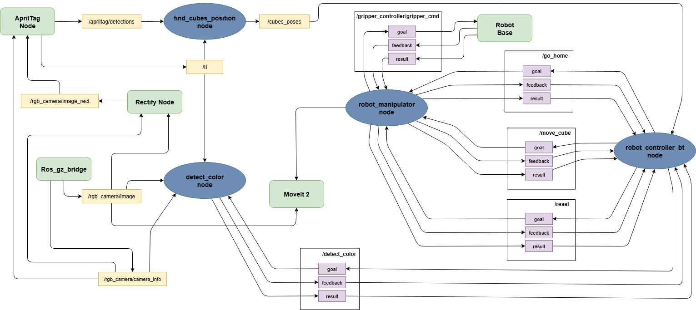

# ur5_apriltag_cube_swap

**Authors:** Matteo Bino (https://github.com/endlessDoomsayer), Gianluca Caregnato(https://github.com/CaregnatoGianluca), Federico Meneghetti (https://github.com/boorgoof)

## Project Overview

This repository contains the implementation of a system designed to autonomously detect, pick, and swap two cubes using AprilTag tracking and color detection.

The main objectives of the project were:
- estimating the pose and colors of 2 cubes by detecting two AprilTags from a fixed camera,
- manipulating the cubes by implementing a motion control interface with MoveIt!,
- orchestrate the whole sequence of actions using high-level logic based on Behaviour Trees;

## Installation and Build

Ensure you have a working ROS2 environment (Jazzy/Humble) and the necessary dependencies installed (MoveIt2, BehaviorTree.CPP v4, AprilTag ROS).

- clone the repository into your workspace:
    ```bash
    cd ~/ros2_ws/src
    git clone https://github.com/PieroSimonet/ir_2526.git
    git clone https://github.com/boorgoof/ur5_apriltag_cube_swap
    ```

- build the package with the specific build.sh script:
    ```bash
    cd ur5_apriltag_cube_swap
    ./build.sh
    ```
    Alternatively you can build with:
    ```bash
    colcon build
    ```
    and source the setup file:
    ```bash
    source install/setup.bash
    ```

## Launch

- launch the program with the specific run.sh script that ensures that previous processes are shut down:
    ```bash
    cd ur5_apriltag_cube_swap
    ./run.sh
    ```
    Alternatively you can launch with:
    ```bash
    ros2 launch g4_launch assignment_2.launch.xml
    ```
## Node Diagram


## Simulation Video

The simulation video can be downloaded [here](https://drive.google.com/file/d/1ojmJ-62V5ZM4hiCZ745qFtYTeBmRhsyO/view).
